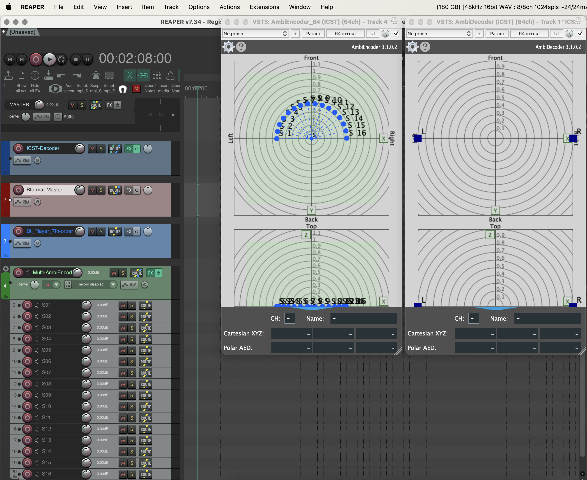

Institute for Computer Music and Sound Technology / (ICST) Zurich University of the Arts

----

The ICST Ambisonics plugins are designed for an intuitive and easy-to-use workflow. 
In this tutorial, we will show you three “how it works” workflows.

To create Ambisonic content, we need the following workflow setup in our DAW:   
-  Mono sources   
- Encoder for the mono movement or placement  
- A B-format master track for bouncing or recording the encoded files  
- A decoder for decoding the B-format (encoded data) for the physical speaker arrangement or binaural (headphone) monitoring.

Overview for the easy signalflow:
  
This image shows a schematic representation of a paradigmatic Ambisonics workflow.

The next image shows a schematic overview of the signal flow of the ICST Ambisonics plugins.

In the DAW Reaper, it looks like this:

-  Master output
- Decoder
- Bformat master
- Bformat (ambiX) player
- MultiEncoder with 16-channel mono source as children tracks.
Of couse your ar free to create your own workflow (see in workflow  '03_step_by_step')

----

## 01 Quick start with the ICST_AmbiPlugins_MultiEncoder.RPP  
  
This workflow is the quick start with the MultiEncoder template.

1. Open the Reaper DAW
2. Open “ICST_AmbiPlugins_MultiEncoder.RPP” via the Reaper menu.
3. Save the template under a new name.

## 02 Open the TrackTemplates

1. Right-click in the empty Reaper track field
2. Select 'Insert track from template
3. Select the desired 'TrackTemplate'

Make sure you create the correct audio routing from channel track to channel track!

----

## 03 Step by Step 

