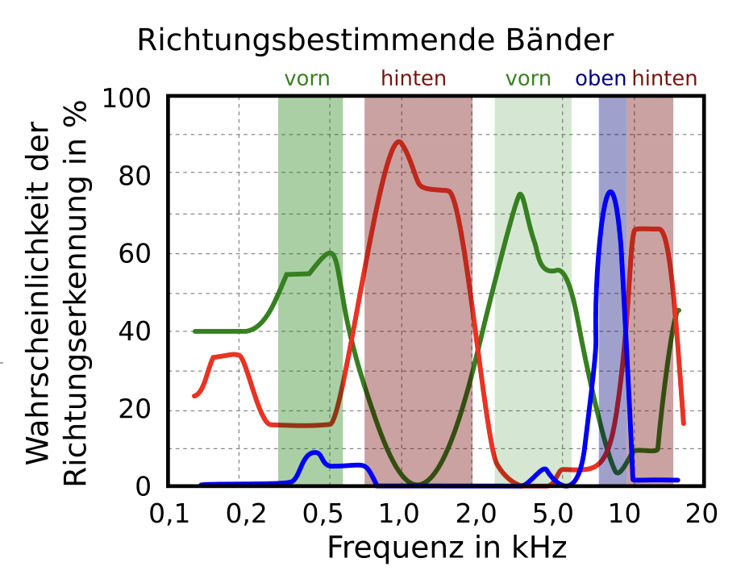
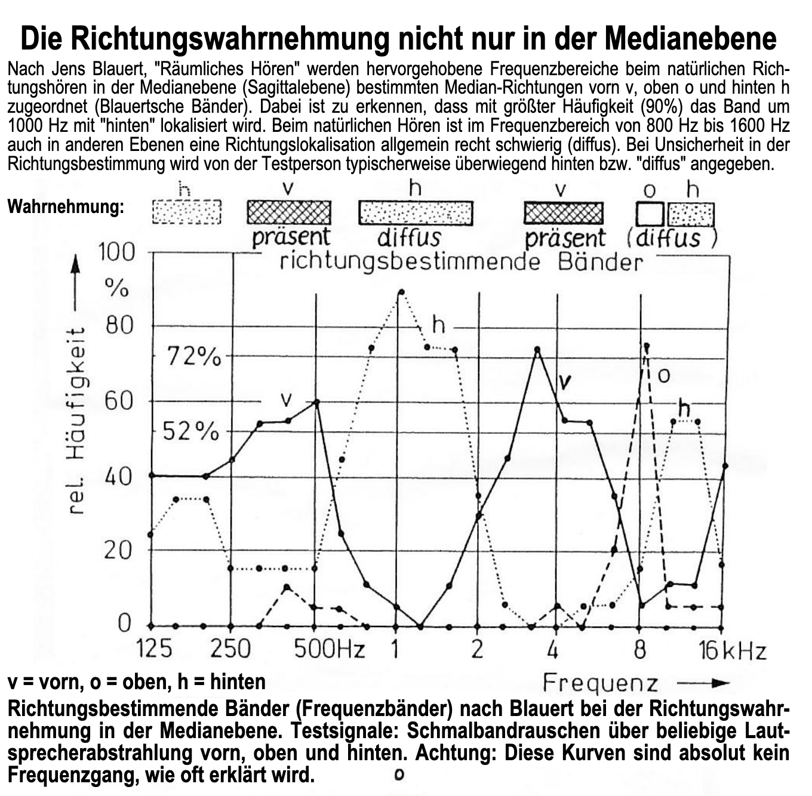
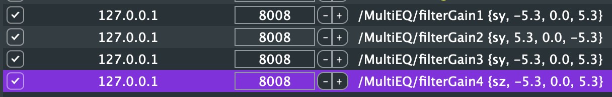
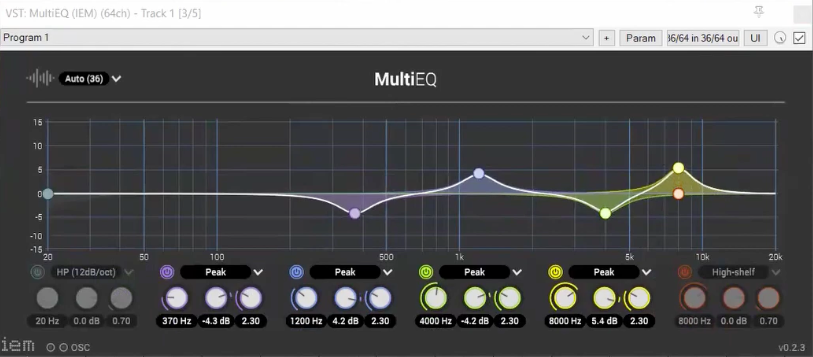
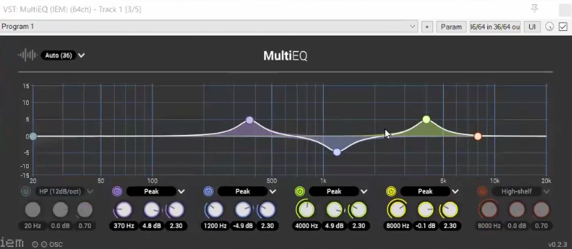
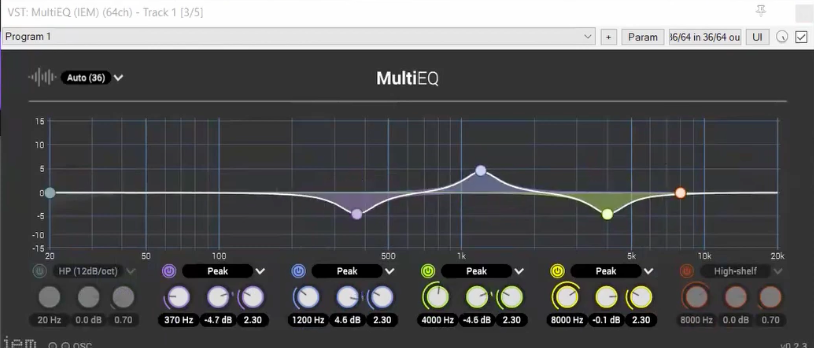

Institute for Computer Music and Sound Technology / (ICST) Zurich University of the Arts

----
# Blauertschen Bänder:

Für die Stimme und derer Directivity Wahrnehmung habe ich Experimente mit den [Blauertschen-Bändern](https://de.wikipedia.org/wiki/Blauertsche_B%C3%A4nder) gemacht. 

So habe ich Y Vorne <-> Hinten und Z  Oben <-> Unten mit dem IEM-Multifilter gekoppelt. 

OSC-OUT: 8008
- ICST Encoder OSC-Out Hight: --> /MultiEQ/filterGain4 {sz, -5.3, 0.0, 5.3}
OSC-IN: 8008
- Z--> IEM MultiEQ: /MultiEQ/filterGain4 (Float)

OSC-OUT: 8008
- ICST Encoder OSC-Out Front: --> /MultiEQ/filterGain4 {sz, -5.3, 0.0, 5.3}
- Y--> IEM MultiEQ: 

---
IEM-MultiEQ
Hight:

Front:

Back:

----

### Gedanken & Beschreibungen zu den Arbeitsschritten
1. Wie kann ich Präsenz der Front und des Hinter mir, sowie das Höhen & Tiefen Gefühl besser hörbar machen?
2. Created OSC Communication bethween Encoder (Y,Z) & IEM MultiEQ (Blauertschebänder)
3. Mono-Encoder FX-Chain "Blauertschebänder-Ambi" eingerichtet.

### Links:
- [Blauertschebänder](https://de.wikipedia.org/wiki/Blauertsche_B%C3%A4nder)
- [sengpielaudio.com/DieBedeutungDerBlauertschenBaender.pdf](https://sengpielaudio.com/DieBedeutungDerBlauertschenBaender.pdf)
- 
