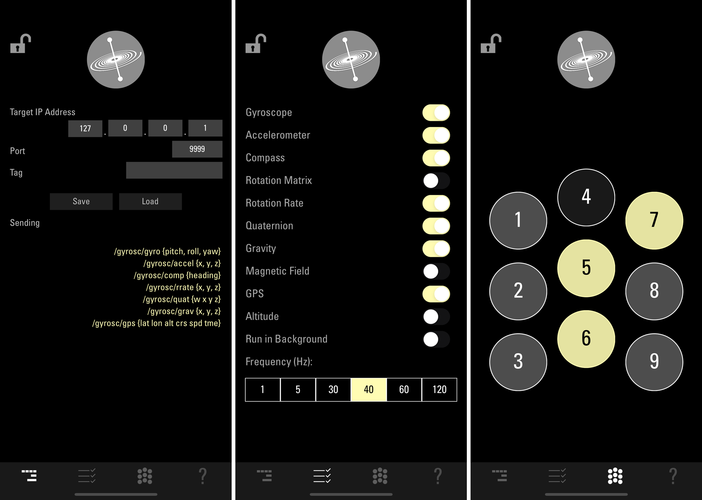
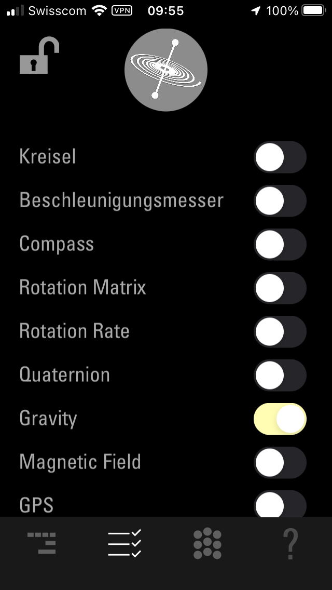
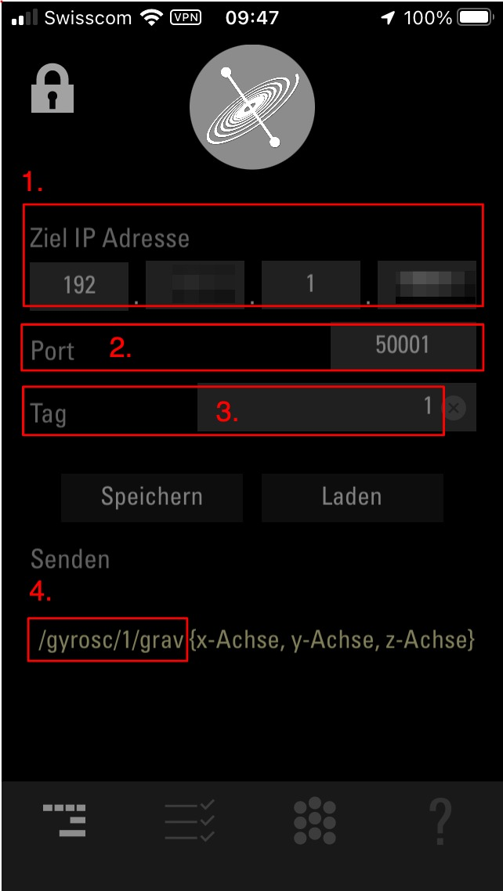
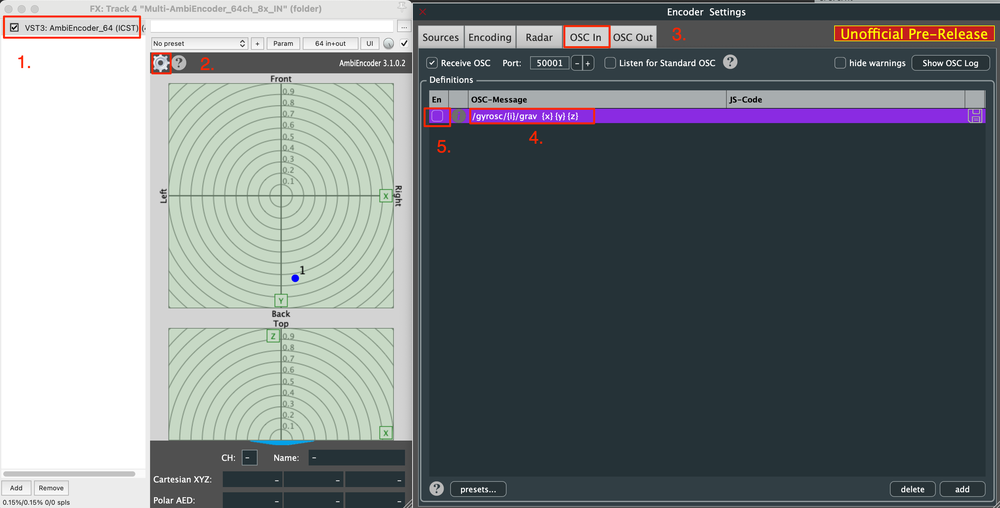
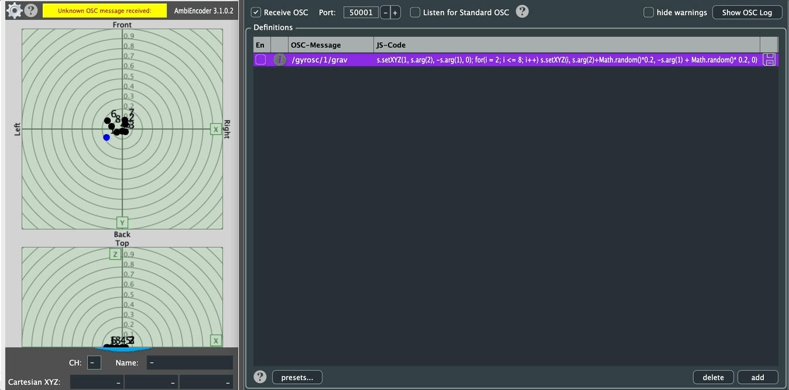

Institute for Computer Music and Sound Technology / (ICST), Zurich University of the Arts

---

ICST MultiEncoder und iOS [GyrOSC.app ](https://www.bitshapesoftware.com/instruments/gyrosc/)

**GyrOSC** ist ein leichtes Utility, das Bewegungssensordaten (von deinem iPhone, iPod Touch oder iPad) über ein lokales Wireless-Netzwerk an jede OSC-kompatible Host-Anwendung sendet. Es ermöglicht dir, Live-Audio- oder Video-Anwendungen mit den integrierten Sensoren deines Geräts (Gyroskop, Beschleunigungsmesser, Kompass und Höhenmesser) zu steuern.

Das folgende GIF zeigt, wie der ICST AmbiEncoder OSC-Daten von der GyrOSC-App empfängt.

 

### Funktionsweise:

Dieses Tutorial bietet eine Schritt-für-Schritt-Anleitung zur Verwendung der iOS-App _GyrOSC_ mit dem ICST Ambisonics Encoder.

#### Einrichtung der GyrOSC-App:

1. Lade die [GyrOSC-App](https://apps.apple.com/us/app/gyrosc/id418751595) herunter.
2. Konfiguriere die App wie folgt:
    - Aktiviere _Gravity_ (deaktiviere alle anderen Sensoren).

 
#### OSC-Konfiguration in der GyrOSC-App:

1. Gebe die IP-Adresse deines Computers im Feld (1) ein.
2. Die Standard-Portnummer für den ICST Ambisonics Encoder ist 50001 (Feld 2).
3. Wähle den Index (Quellennummer) für das Plugin im Feld (3).
4. Feld (4) zeigt die von GyrOSC gesendete OSC-Nachricht.

Die GyrOSC-App sendet die 'Gravity'-Daten via OSC (Port 50001) zum ICST MultiEncoder.

### Einrichtung des ICST Ambisonics Encoder Plugins:

1.  Öffne das ICST AmbiEncoder_64 Plugin.
2. Rufe die Encoder Settings auf.
3. Öffne den _OSC IN_ Bereich und aktiviere OSC-IN (Port: 50001).
4. Doppelklick im Feld _OSC-Message_ und gebe ein:

    `/gyrosc/{i}/grav {x} {y} {z}`

5. Aktiviere das Plugin durch Auswahl von _en_.
6. Bewege dein iPhone, um Bewegungsdaten zu generieren.

---

# Inspirationen:

### OSC-Swarm

**OSC-Message:**

`/gyrosc/1/grav`

JS-Code:

`s.setXYZ(1, s.arg(2), -s.arg(1), 0); for(i = 2; i <= 8; i++) s.setXYZ(i, s.arg(2)+Math.random()*0.2, -s.arg(1) + Math.random()* 0.2, 0)`

---
©2025 ICST

