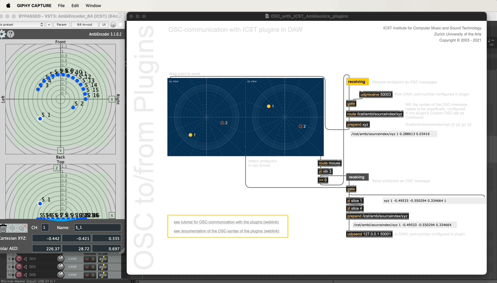

Institute for Computer Music and Sound Technology / (ICST) Zurich University of the Arts

* * *
### OSC <-->  Max to AmbiEncoder

#### Quick look how you work with MaxMSP (ore others) over OSC.

1. Prepare Max 9.0 and the Reaper DAW for OSC 
2. In Reaper, open “Settings” > “Control/OSC/Web”
3. Select “OSC” and edit the parameters as shown in the next figure 
   

4. Open the “ICST AmbiEncoder” in an FX slot and go to “Encoder Settings”
5. Go to “OSC In” and activate the incoming OSC port: (eg. 50001)
   
6. Click on the 'OSC Out' tap and activate the OSC Out port: 
   - ICST AmbiPlugins Standard XYZ Index

> [!Note:] In the Max-demo patch we will wait for this  '/icst/ambi/sourceindex/xyz'

7. Open MaxMSP and look for the 'OSC-communication with ICST plugins in DAW' patch.
8. See the next demo gif.

----
©2025 ICST

