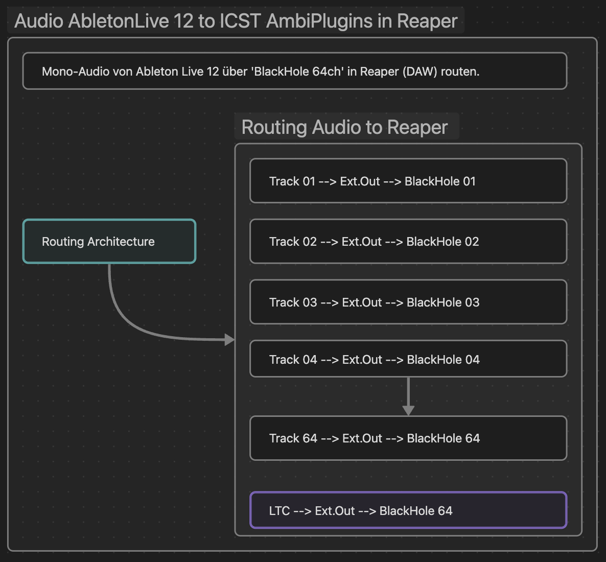
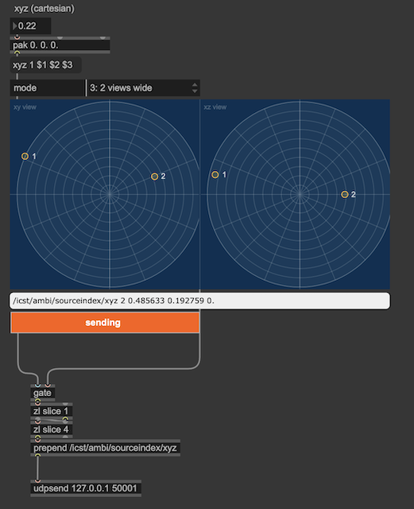
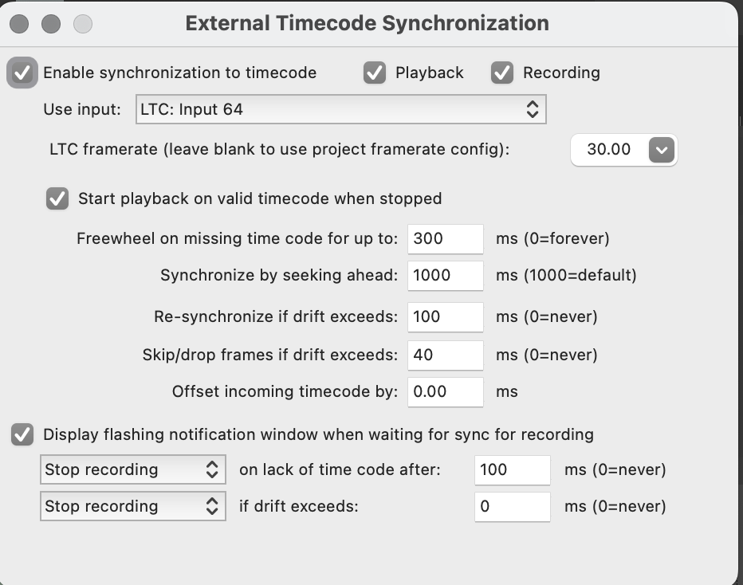
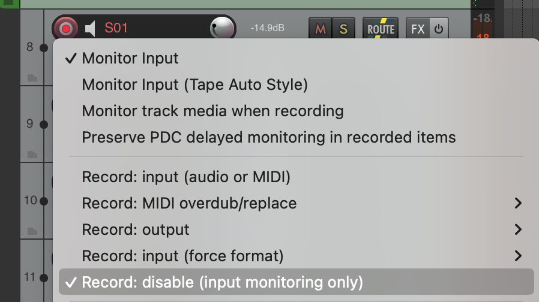
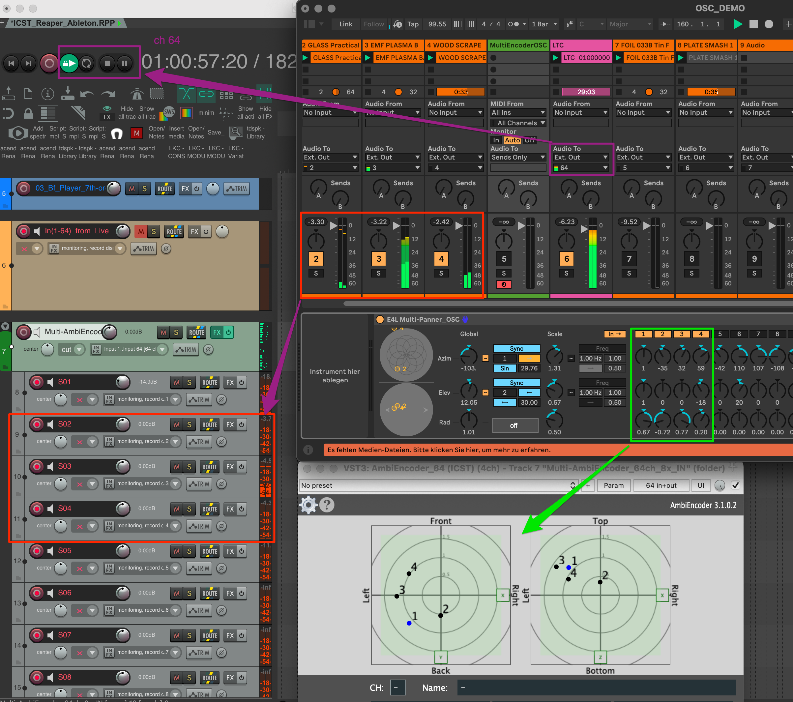
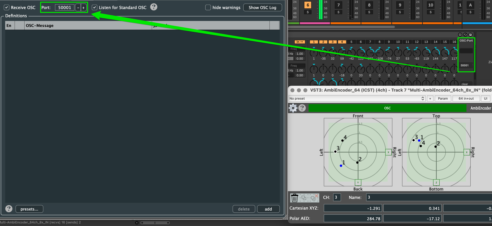
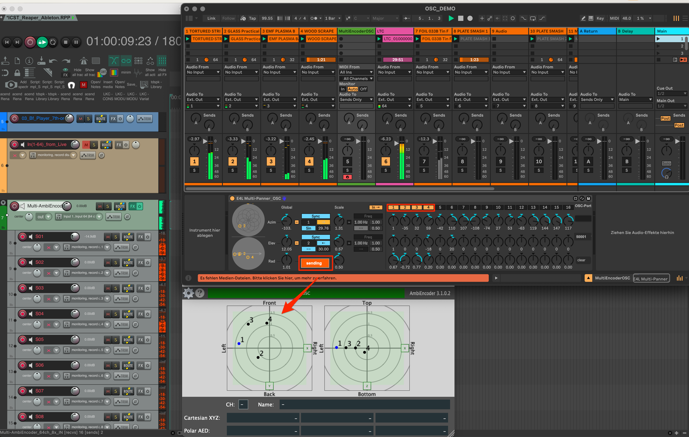
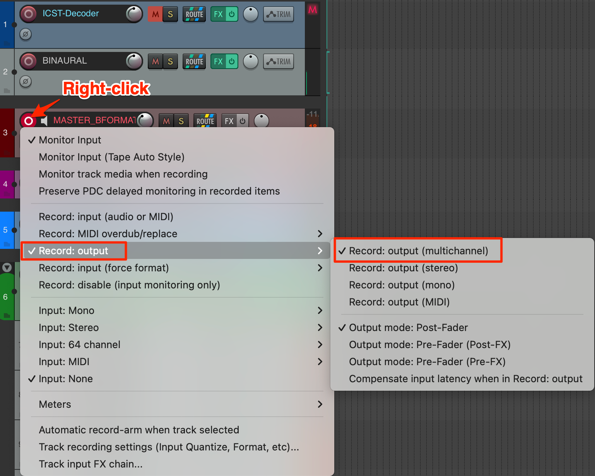
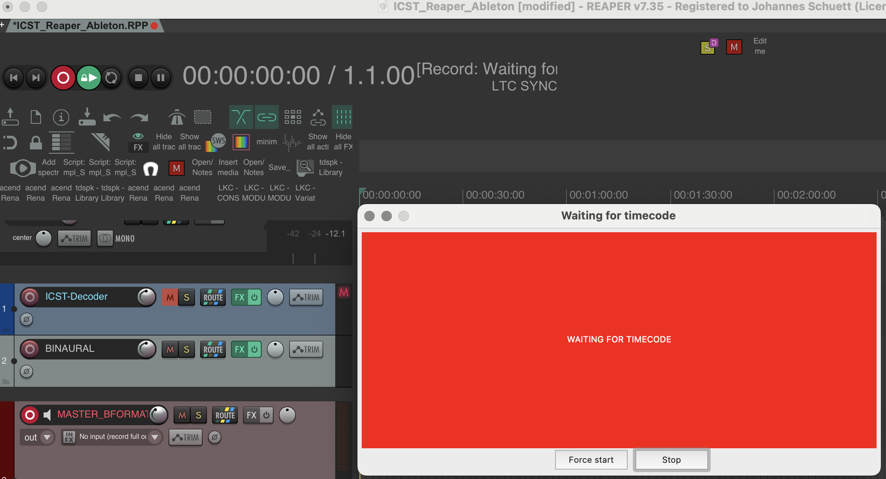
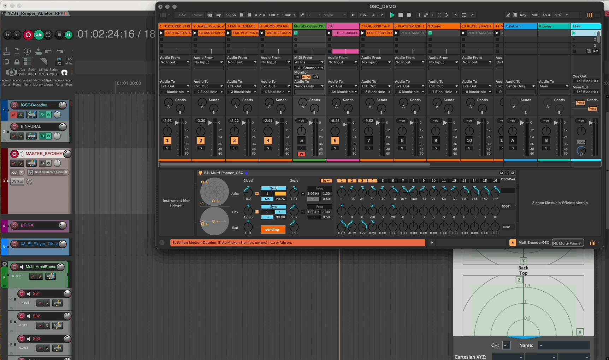

* * *
# AbletonLive zu ICST Ambisonics MultiEncoder in Reaper

**Für wen:** Level: Advanced | Zielgruppe: Ableton/Reaper-Hybrid-Producer.

Dieses Tutorial bietet eine detaillierte Anleitung zur Aufnahme von 7. Ordnung Ambisonics mit Ableton Live und Reaper. Es richtet sich an Benutzer mit grundlegenden Kenntnissen beider Programme. Wenn du mit den Konzepten von Ableton Live, Reaper und Ambisonics vertraut bist, sollten die Schritte einfach sein. Andernfalls können einige Abschnitte herausfordernd sein. In diesem Fall wird empfohlen, zuerst die Grundlagen dieser Software und der Ambisonics-Technologie zu erlernen.
### Ableton zu ICST MultiEncoder in Reaper

Ableton überträgt Audio über "BlackHole" (bis zu 64 Kanäle) zu Reapers BlackHole-Eingangsgeräten.

Der Multi-Panner-OSC kann bis zu 16 OSC-Kanäle via localhost auf Port 50001 zum ICST Multi-AmbiEncoder senden. In Reaper werden Audio-Eingänge von BlackHole (1-4) empfangen, während der ICST Multi-AmbiEncoder OSC-Quellen (1-16) verarbeitet.

Dieses Setup ermöglicht die Aufnahme von B-Format bis zur 7. Ordnung aus Ableton Live 12.

---

### Funktionsweise

#### Schematische Übersicht:

#### Vorbereitung:

- Installiere [AbletonLive 12](https://www.ableton.com/de/live/)
- Installiere [Reaper (DAW)](https://www.reaper.fm/)
- Installiere [BlackHole64](https://www.blackhole.audio/)
- Download: [E4L_Multi-Panner_OSC.adv](https://github.com/joambi/icst-ambisonics.github.io/blob/main/static/downloads/E4L%20Multi-Panner_OSC.adv)  Dies ist ein modifizierter Panner von [EnvelopforLive](https://github.com/EnvelopSound/EnvelopForLive/wiki)

----
### Setup
#### In Ableton Live

1. Erstelle bis zu 64 Mono-/Stereo-Spuren mit Audio- oder MIDI-Inhalten.
2. Leite die Ausgänge als externe Ausgänge weiter (1-64).
3. Reserviere Spur 64 für den LTC-Timecode.

**Hinweis**: Ich habe gelesen, dass es Schwierigkeiten mit der bidirektionalen Synchronisierung zwischen Reaper und Ableton Live geben könnte. Ich habe mich daher für die stabile LTC-Timecode-Variante entschieden.

4. Erstelle Raumalisierungsspuren mit 'E4L_Multi-Panner_OSC.adv' für Automation (max. 16 Quellen pro Panner).
5. Sende optional benutzerdefinierte OSC-Raumalisierungsdaten von Max, um konsistente OSC-Portnummern in Reaper zu gewährleisten (Port: 50001).

    
Tipp: Stelle sicher, dass du die gleichen OSC-Portnummern in Reaper verwendest. (Port: 50001)

#### In Reaper

1. Erstelle eine Session mit 63 Mono-Spuren (Spur 64 für LTC-Timecode).
2. Aktiviere LTC-Synchronisierungseingabe auf Spur 64, indem du mit der rechten Maustaste auf die Playbar klickst.

3. Stelle alle aktiven Spuren auf "Record: Disable (monitor only)."
   

4. Leite Spuren 1-63 zum ICST MultiEncoder_64 weiter.

- Wenn korrekt geroutet, erscheint die Quelle im Encoder-Radar zur Verifizierung.

5. Konfiguriere die OSC-Verbindung zwischen Ableton und ICST MultiEncoder. Jeder Encoder benötigt seinen eigenen OSC-Port.

    
6. Aktiviere OSC-Übertragung in E4L_Multi-Panner. Der ICST MultiEncoder zeigt bewegliche Punkte an, wenn OSC-Daten empfangen werden.
   
7. Klicke in Reaper auf Record -Output, um dein Bformat aufzunehmen. Siehe nächstes Bild.
   
8. Klicke dann auf REC in Reaper → du erhältst die folgende Nachricht "Waiting for Timecode"
   

9. Drücke Play in Ableton Live, um Reaper via LTC Sync (Input 64) zu synchronisieren, was die B-Format 7. Ordnung Ambix-Aufnahme ermöglicht.
10. Wechsle zum **Start Marker** bei **01:00:000** (LTC hat einen 60'-Offset), dann drücke **Fire** oder **Play** in Ableton Live, um die Aufnahme zu starten.

Weitere Details findest du in der Dokumentation für Ableton Live, Reaper und den ICST MultiEncoder.

----
