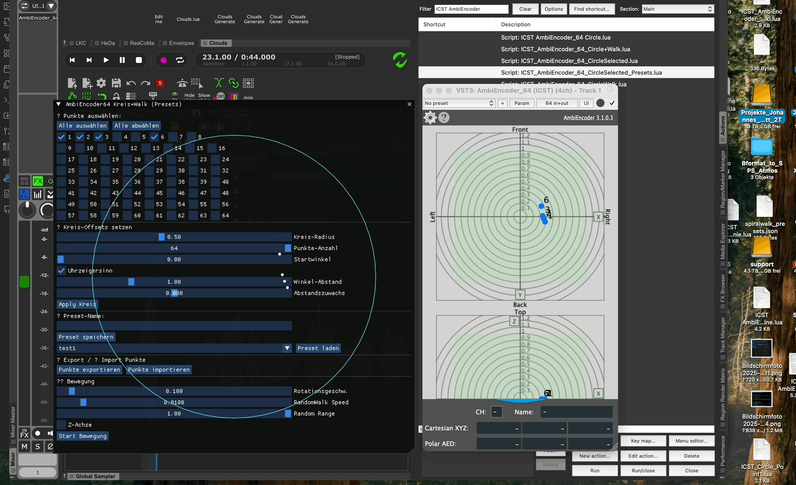

# ICST_AmbiEncoder_64_CircleSelected_Lua-Presets

Level: Intermediate | **Audience:** Reaper power user, Performance artist.

## 📃 Benutzer-Dokumentation
**Script:** `ICST_AmbiEncoder_64_CircleSelected_Presets.lua`  
**Funktion:** Punkte des ICST AmbiEncoder_64 Plugins grafisch auswählen, im Kreis anordnen, bewegen (Rotation/RandomWalk) und als Preset speichern/laden.



---

## 🚀 Installation

1. **Datei speichern**  
   Lege die Datei `ICST_AmbiEncoder_64_CircleSelected_Presets.lua` in deinen REAPER-Scripts-Ordner:  
   ```
   /Users/<name>/Library/Application Support/REAPER/Scripts/ICST_AMBI/
   ```

2. **In REAPER registrieren**  
   - Öffne REAPER → `Actions` → `Show Action List...`  
   - Klick auf `ReaScript: Load...`  
   - Wähle die Datei und bestätige.  
   - Das Script ist nun als Action verfügbar.

3. **AmbiEncoder laden**  
   - Lege auf eine Spur das Plugin `AmbiEncoder_64 (ICST)` und markiere die Spur.  
   - Starte das Script über die Action List.

---

## 🖥️ GUI-Elemente & Bedienung

### ✅ Punkte auswählen
- Alle 64 Punkte erscheinen als Checkboxen.
- Aktiviere nur die Punkte, die du steuern willst.
- Buttons:
  - **Alle auswählen**
  - **Alle abwählen**

---

### 🔄 Kreis-Offsets setzen
- **Kreis-Radius:** Abstand der Punkte vom Zentrum.
- **Punkte-Anzahl:** Anzahl der Punkte auf dem Kreis.
- **Startwinkel:** Dreht den Kreis.
- **Uhrzeigersinn:** Reihenfolge invertieren.
- **Winkel-Abstand:** Skaliert den Winkel zwischen den Punkten.
- **Abstandszuwachs:** Jeder folgende Punkt kann weiter außen liegen.

**Apply Kreis:** 👉 Überträgt die Parameter auf die aktivierten Punkte.

---

### 💾 Preset-Verwaltung
- **Preset-Name:** Eingabefeld für den Namen.
- **Preset speichern:** Speichert die aktuellen Kreis-Parameter in
  `REAPER/ResourcePath/AmbiPresets/`.
- **Preset wählen:** Dropdown mit allen vorhandenen Presets.
- **Preset laden:** Übernimmt gespeicherte Werte.

---

### 📤 Punkte Export/Import
- **Punkte exportieren:** Speichert die aktuelle Auswahl in `points_export.txt` im REAPER-ResourcePath.
- **Punkte importieren:** Lädt eine gespeicherte Auswahl per Dialog.

---

### ⚙️ Bewegung
- **Rotationsgeschw.:** Umdrehungen pro Sekunde.
- **RandomWalk Speed:** Schrittweite der Zufallsbewegung.
- **Random Range:** Maximaler Bewegungsradius.
- **Z-Achse:** Punkte auch in Z bewegen.
- **Start Bewegung / Stop Bewegung:** Startet oder stoppt die Animation.

> Beim Start werden die aktuellen Positionen als Basis übernommen.

---

## 🎨 Visualisierung
- Im Fenster siehst du eine Echtzeit-Darstellung:
  - Weiße Punkte = aktuelle Positionen der ausgewählten Punkte.
  - Linien verbinden die Punkte in Reihenfolge.
  - Blauer Kreis = maximaler Bewegungsradius (Random Range).

---

## 📁 Speicherorte
- **Preset-Dateien:** `REAPER/ResourcePath/AmbiPresets/<presetname>.txt`
- **Exportierte Punkt-Sets:** `REAPER/ResourcePath/points_export.txt`

---

## ✨ Tipps & Hinweise
- Wähle nur die Punkte aus, die du brauchst → übersichtlicher und ressourcenschonend.
- Speichere verschiedene Presets (kleiner Radius, großer Radius, etc.).
- Preset-Dateien sind einfache Textdateien und können auch extern editiert werden.

---

## 🔧 Anforderungen
- REAPER mit aktivem `ICST AmbiEncoder_64 (VST3)`
- ReaPack mit ReaImGui installiert:
  - `Extensions → ReaPack → Browse Packages → ReaImGui`
- REAPER 6.x oder höher empfohlen.

---

## 🏷️ Version & Autor
- **Version:** Juli 2025
- **Autor:** Johannes Schütt &  Reaper-Assistent ✨
- **Features:** Presets, Export/Import, Visualisierung, auswählbare Punkte


