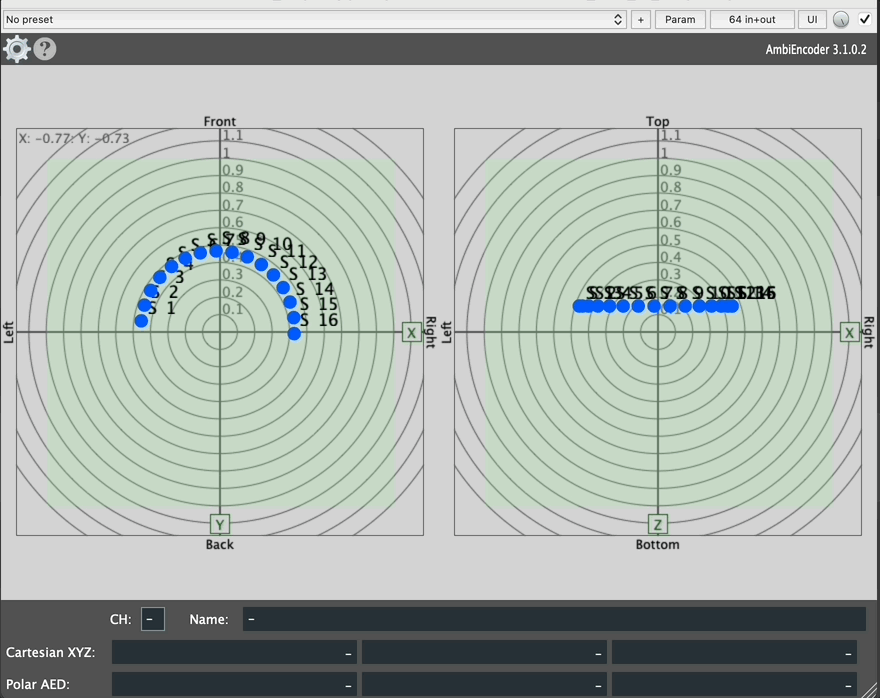
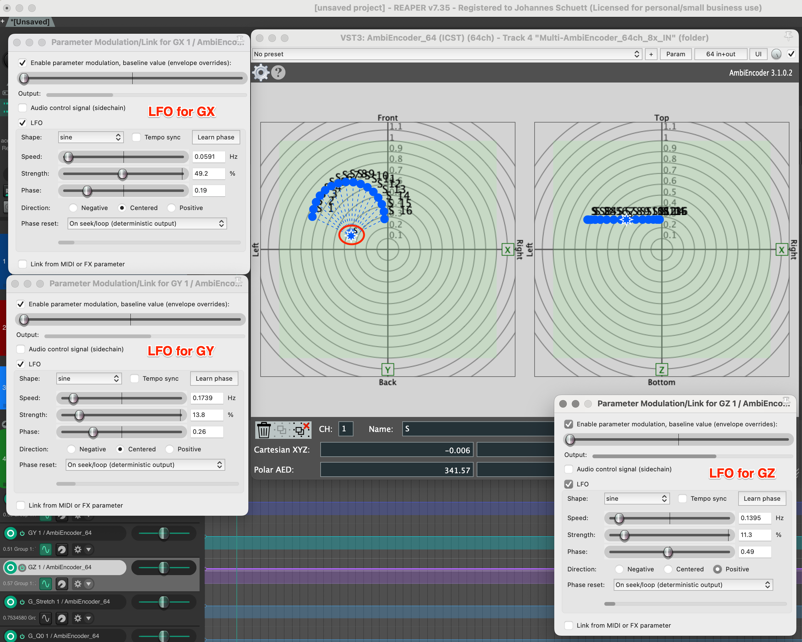
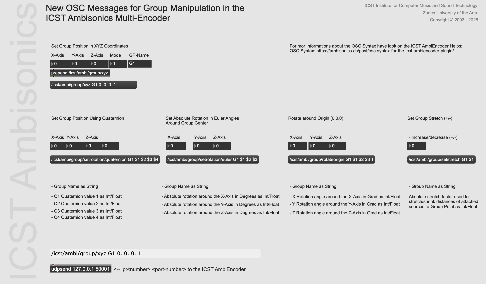

Institute for Computer Music and Sound Technology (ICST) Zurich University of the Arts

---

# Gruppenanimation

**Für wen:** Level: Intermediate | Zielgruppe: Komponist:in, Live-Performer:in.

Der **ICST Multi-Ambisonics Encoder v.2+** bietet ein **Gruppenanimations-Tool** zur dynamischen Manipulation gruppierter Audioquellen in der **Radar-Anzeige**. Durch Auswahl eines Gruppenpunkts und Halten von **Option (Alt) auf Mac** schaltest du erweiterte Funktionen wie **Gruppenanimation** und **Gruppenstrecken** frei, die es dir ermöglichen, mehrere Quellen synchronisiert zu bewegen und zu transformieren für verbesserte 3D-Raumalisierung.

📺 **Tutorial:** [Points and Radar](https://youtu.be/aDa-vNWriLM) (3:15)

---
### Einfache Animation einer Gruppe

1. **Punkte auswählen** – Klicke um einen Punkt auszuwählen; nutze **Shift + Klick** für mehrere Punkte.
2. **Gruppe erstellen** – Klicke auf das **Group**-Symbol um einen Gruppenpunkt zu erstellen (z.B. 'S').
3. **Gruppe verschieben** – Halte **Shift** und ziehe den Gruppenpunkt.
4. **Punkte um Gruppe rotieren** – Halte **Alt**, dann ziehe und lasse das **Rotate-Around-Group**-Symbol fallen.
5. **Gruppe strecken** – Halte **Alt**, nutze das **Stretch Symbol**, dann bewege die Maus **nach oben/unten** zum Anpassen.
6. **Gruppe um Ursprung rotieren** – Halte **Alt**, dann ziehe und lasse das **Rotate-Around-Origin**-Symbol fallen.

💡 **Tipp:** Diese Funktionen gelten auch für Höhenanpassungen im **Z-Radar**.

### Manuelle Aufnahme

1. Stelle **ICST MultiEncoder** (Track Automation) auf **'LATCH'** (oder **'WRITE'**).
2. Starte die Wiedergabe in **Reaper**, halte **Alt** und nimm deine Bewegung auf.
3. Um die aufgenommene Bewegung abzuspielen, stelle "LATCH" auf "READ".

----
### LFO-Animation einer Gruppe
 
1. Öffne die **LFO Parameter Modulation** im **AmbiEncoder**-Track und aktiviere die Parameter für **GX, GY und GZ**.
 
2. Passe die LFO-Parameter an, z.B. **Geschwindigkeit**, um die gewünschte Bewegung zu erreichen.
Nun bewegt sich die Gruppe automatisch im Radar.

 

💡 **Tipp:** Das Verbinden der LFO-Parameter mit einer MIDI/OSC-Schnittstelle ermöglicht es dir, die Bewegung live zu steuern.

----
### LFO-Gruppenanimation mit Quaternionen

Dies ist ein fortgeschritteneres Beispiel für die Animation einer Gruppe mit **Quaternionen-Parametern**.

💡 **Tipp:** Du kannst die Parameter auch mit einem **Audio-Kontrollsignal** über einen Sidechain steuern.

---
### Gruppenanimation aus einer externen Quelle

Der neue 'ICST Ambi-OSC-Patcher' zeigt die direkten Möglichkeiten der Gruppenanimation. Wir demonstrieren, wie man Gruppen mit OSC aus einer externen Quelle animiert. Der MultiEncoder konvertiert Euler-Winkel intern in Quaternionen. In diesem Beispiel sind die Winkel vom Quellenpunkt (1) entscheidend für die Animation.

Download MaxPatch: [Neuer OSC-Messenger](https://github.com/joambi/icst-ambisonics.github.io/blob/main/static/downloads/OSC-GP-ICST-MultiEncoder.maxpat)
#### Gruppenposition
1. Setze Gruppenposition AED
	- /icst/ambi/group/aed [GroupName] [Azimuth] [Elevation] [Distance] [Mode] Mode (1) = bewege die ganze GP, Mode (0) = bewege nur den GP-Punkt.
	- `/icst/ambi/group/aed 'G1' 135 0 0.1 1`
2. Setze Gruppenposition XYZ
	- /icst/ambi/group/xyz [GroupName] [X] [Y] [Z] [Mode]:
	- `/icst/ambi/group/xyz 'G2' 0.1 0.1 0 0`

### **OSC-Animation**

Der ICST MultiEncoder kann jetzt direkt mit Euler-Winkeln via OSC gesteuert werden.

----
©2025 ICST
