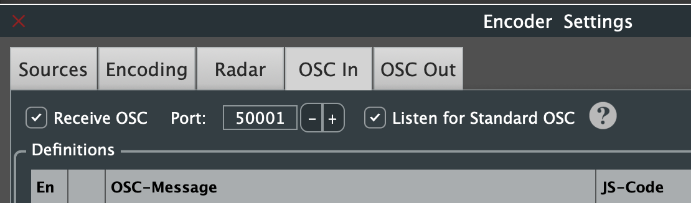
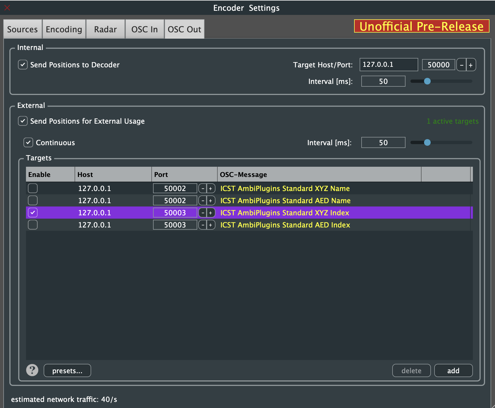
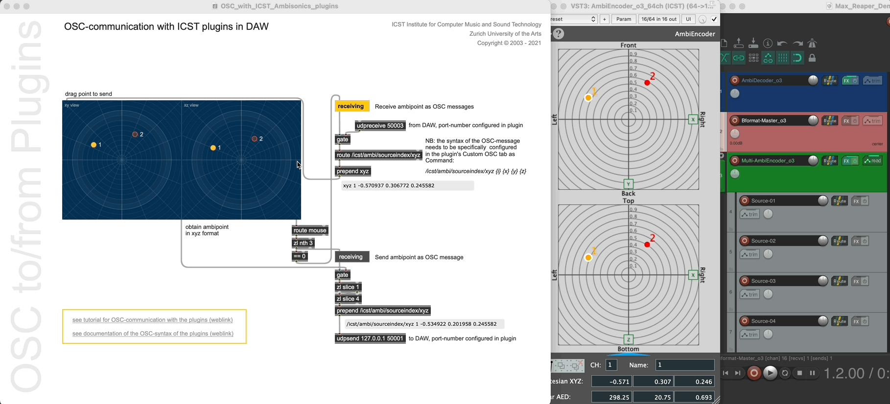

Institute for Computer Music and Sound Technology / (ICST) Zurich University of the Arts

---
# Bidirectional OSC Communication with MaxMSP

Generate motion data in Max and send it via OSC to the _ICST AmbiEncoder_ in your DAW. Alternatively, transfer a motion composition from your DAW to the _icst.ambisonics-externals_.

### **Required Software:**

- **MaxMSP v.8.0+** → [cycling74.com](http://cycling74.com)
- **ICST Ambisonics Tools v3** → [cycling74.com](http://cycling74.com)
- **ICST Ambisonics Plugins (VST3/AU)** → [ICST AmbiPlugins](https://github.com/schweizerweb/icst-ambisonics-plugins/releases)
- **Reaper (DAW)** → [reaper.fm](http://reaper.fm/download.php)

### **Setup Guide:**

#### 1. Configure OSC in ICST AmbiEncoder

- Open the _ICST AmbiEncoder_ in an FX slot and navigate to **Encoder Settings**.
- Under **OSC In**, activate the OSC input port (e.g., `50001`).
   
- Click **OSC Out** and enable the OSC output port.
    - Uses **ICST AmbiPlugins Standard XYZ Index**.
- The Max demo patch listens for:
    `'/icst/ambi/sourceindex/xyz'`

   

#### 2. Open MaxMSP and Load the Patch

- Find the _OSC communication with ICST plugins in DAW_ patch.

See the demo Gifs:
- 

Next Gif: How it works:


---

## Sending Absolute Angles (Euler Coordinates)

To send **absolute angles** using **Euler coordinates** from MaxMSP to the ICST AmbiEncoder, use the following OSC message format:

```
/icst/ambi/source/euler [ChannelName] [Yaw] [Pitch] [Roll]
/icst/ambi/source/euler 'S1' 30 15 5
```

For **index-based addressing**:

```
/icst/ambi/sourceindex/euler [ChannelIndex] [Yaw] [Pitch] [Roll]
/icst/ambi/sourceindex/euler 1 30 15 5
```

**Note:**

- `Yaw` (Azimuth): Horizontal rotation
- `Pitch` (Elevation): Vertical tilt
- `Roll`: Rotation around the forward axis

----
<span style="font-size:9px;color:#9f9f9f;">©2025 ICST</span>
