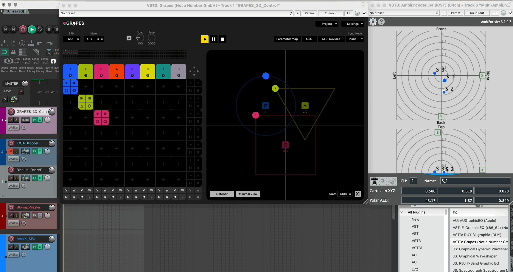

Institute for Computer Music and Sound Technology (ICST) Zurich University of the Arts

---

-----
  
[Grapes 3D Control](https://grapes-3d.com/) is a handy addition to the ICST Ambisonics plugins.
Grapes come as a standalone and VST3 and can be operated directly in the DAW (Reaper) in sync. 

### Advantages of Grapes 3D Control

A major advantage of this method is that the 3D spatial sound control does not have to be recorded in the DAW. Instead, it is sent to the ICST AmbiEncoders via OSC from Grapes. This means that the spatial design remains flexible and can also be interpreted with other spatialization tools such as LISA, Dolby Atmos or binaural audio playback.

For more information, see: https://grapes-3d.com/

----
©2025 ICST