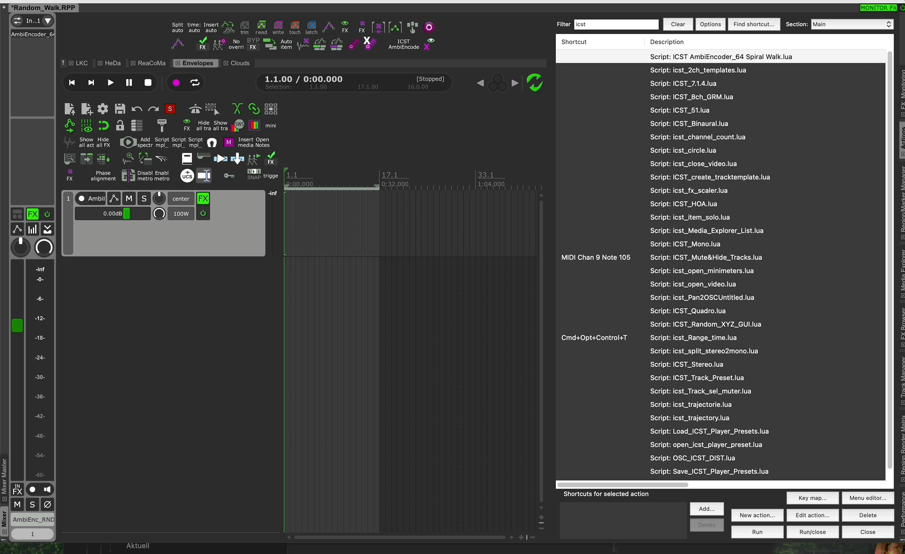
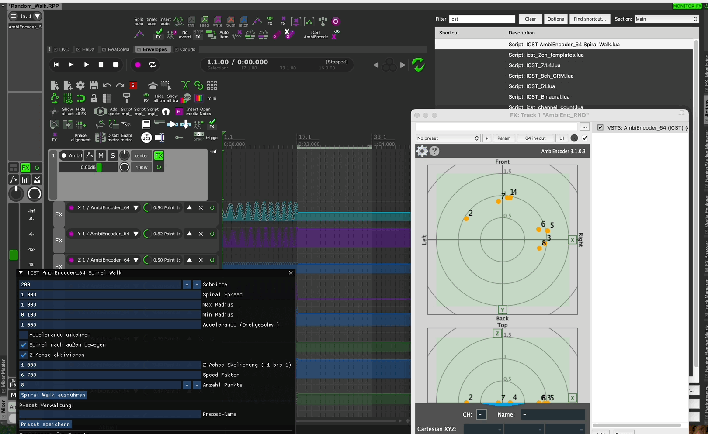

---
tags:
  - ambiencoder
  - luascript
  - reaper_script
date: 2025-07-17T14:31:00
title: icst_scripts
---
# **ICST AmbiEncoder_64 Spiral Walk - Dokumentation**

### 🔍 **Funktion**

Dieses ReaScript generiert Spiralbewegungen (z.B. expandierende Spiralen) für die X-, Y- und optional Z-Koordinaten des VST3 "ICST AmbiEncoder_64" in REAPER. Es erlaubt dir, Bewegungsverläufe auf Basis von Startpositionen deiner Punkte zu erzeugen und automatisch als Envelope einzufügen. Das Ganze erfolgt grafisch via ReaImGui mit einstellbaren Parametern und Preset-Speicher.
![[Bildschirmfoto 2025-07-18 um 09.45.30.png]]

---

### ⚖️ **Features**

- Startposition der Punkte wird dynamisch ausgelesen
- Spiralbewegung mit Schrittzahl, Radiuslimit, Spread, Geschwindigkeit
- Z-Achse kann ein-/ausgeschaltet und skaliert werden
- GUI mit ReaImGui
- Presetverwaltung (Save, Load, Delete)
- Speicherort für Presets auswählbar (JSON-Datei)

---

### 🔧 **Installation & Setup**

1. **Voraussetzungen:**
    - REAPER installiert
    - VST3-Plugin [**ICST AmbiEncoder_64**](https://ambisonics.ch/icst-ambisonics-plugins/02_installation/) muss auf Track geladen sein
    - ReaImGui Extension (https://github.com/cfillion/reaimgui) installiert
2. **Script-Speicherung:**
    - Kopiere das Script in einen beliebigen Ordner z.B. `Scripts/ICST_AMBI/`
    - Speichere die Datei z.B. als `ICST AmbiEncoder_64 Spiral Walk.lua`
3. **Einbindung in REAPER:**
    - REAPER > Actions > Show Action List
    - "Load ReaScript" > wähle die `.lua`-Datei aus
    - Mit [Add] zum Action List hinzufügen
4. **Verwendung:**
    - Selektiere einen Track mit geladenem' ICST AmbiEncoder_64'
    - Wähle im Arrange-Fenster eine Zeit-Selection
    - Starte das Script
    - Stelle Parameter im GUI ein (z.B. Schritte, Radius, Spread)
    - Klicke auf "Spiral Walk ausführen"
5. **Preset-Verwaltung:**
    - Preset-Namen eingeben > Speichern
    - Preset auswählen > Laden oder Löschen
    - Speicherort für JSON-Datei im GUI änderbar

---
### 📊 **Analyse & Technik**

- Parameter-Mapping basiert auf Screenshot-Anordnung: jeder Punkt nutzt 3 Parameter (X, Y, Z)
- Die Spiralbewegung wird mathematisch generiert (∅ Radius + Spread, θ Winkel)
- Normierte Werte werden auf 0-1 skaliert und in Envelopes geschrieben
- Z-Werte werden konstant gehalten oder skaliert wiederholt

---
### ❓ Tipps & Hinweise

- Achte darauf, dass du im richtigen Zeitbereich arbeitest (Reaper Timeline Selection)
- Die Spiralbewegung basiert auf Startposition jedes Punktes
- Der Skalierungsfaktor für Z hat keinen Einfluss, wenn Z deaktiviert ist
- Min Radius < 0.1 ist nicht erlaubt (Verhinderung unphysikalischer Spiralen)

---
# Example:

Spiral_Walk_out:

Spiral_Walk_in:

