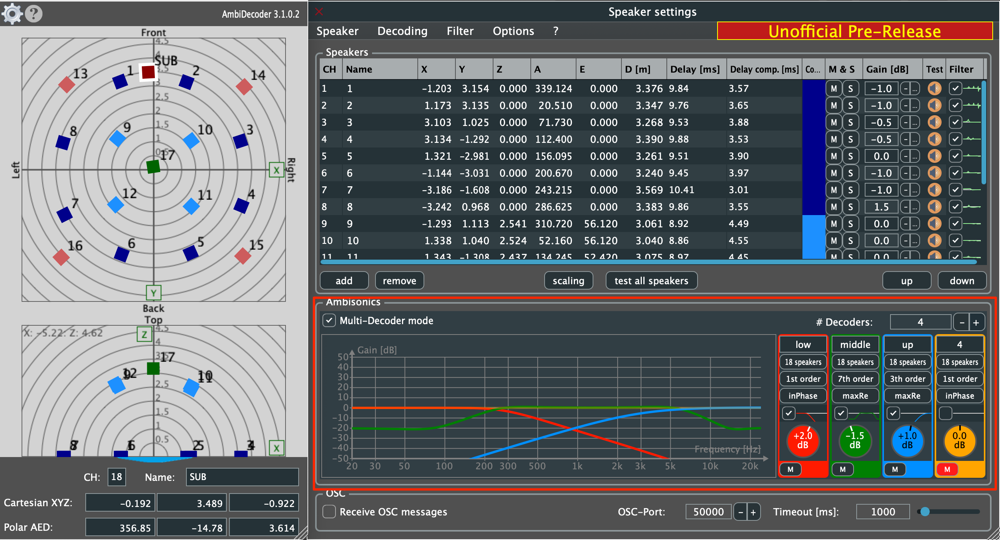

Institute for Computer Music and Sound Technology (ICST) Zurich University of the Arts

---

# Multi-Decoder Modus

**Für wen:** Level: Advanced | Zielgruppe: Techniker:in, Studio-Engineer.

Der **Multi-Decoder Modus**, eingeführt in **ICST AmbiDecoder v3.2**, ermöglicht es dir, bis zu **vier vollständig unabhängige Decoder** in einer einzelnen Plugin-Instanz auszuführen. Dies ist ideal für komplexe Lautsprechersetups, die unterschiedliche Sprecherarrays kombinieren — zum Beispiel einen Hauptambisonics-Ring zusammen mit Höhenlautsprechern, einer Subwoofer-Gruppe oder einem separaten Nahfeld-Array.

---

## Wann man den Multi-Decoder Modus verwendet

Verwende den Multi-Decoder Modus, wenn dein Setup enthält:

- **Mehrere Sprecherschichten** (z.B. horizontaler Ring + Höhenkuppel)
- **Mixed-Order Dekodierung** (z.B. 3. Ordnung für horizontal, 1. Ordnung für Höhe)
- **Unterschiedliche Sprechergeometrien**, die separate Presets benötigen
- **Unabhängige Gain- und Filtereinstellungen** pro Lautsprechergruppe

Für einfache Setups (einzelnes Array, einzelne Geometrie) ist der Standard-Single-Decoder-Modus ausreichend.

---

## Aktivierung des Multi-Decoder Modus

1. Öffne das **ICST AmbiDecoder** Plugin in deiner REAPER FX-Kette.
2. Im **Decoder Settings** Panel, finde die **Multi-Decoder** Schaltfläche.
3. Aktiviere den Multi-Decoder Modus — vier Decoder-Slots (A, B, C, D) erscheinen.

> [!Tip:]
> Jeder Decoder-Slot ist vollständig unabhängig und kann separat konfiguriert werden, ohne die anderen zu beeinflussen.

---

## Konfiguration jedes Decoders

Für jeden der vier Decoder kannst du einstellen:

### 1. Name und Farbe
- Gebe jedem Decoder einen aussagekräftigen Namen (z.B. "Ring", "Height", "Sub", "Near").
- Weise eine benutzerdefinierte Farbe für einfache Identifikation in der Benutzeroberfläche zu.

### 2. Lautsprecherauswahl
- Jeder Decoder hat seine **eigene Lautsprecherauswahl**.
- Weise spezifische Lautsprecher aus deinem Lautsprecherpreset jedem Decoder zu.
- Lautsprecher können immer nur zu einem Decoder gehören.

### 3. Ambisonics-Reihenfolge
- Stelle die **Dekodierreihenfolge unabhängig** pro Decoder ein (1. bis 7. Ordnung).
- Niedrigere Ordnungen (1.–2.) eignen sich für spärliche oder schwierige Sprechergeometrien.
- Höhere Ordnungen (3.–7.) geben präzisere Ortung für dichte Arrays.

### 4. Ambisonics-Gewichtung
- Wähle das Gewichtungsschema (z.B. MaxRe, inPhase, Basic) pro Decoder.
- MaxRe wird für die meisten praktischen Setups empfohlen.

### 5. Filter
- Acht Filteroptionen sind pro Decoder verfügbar.
- Passe pro-Decoder EQ und räumliche Filterung unabhängig an.

### 6. Stumm und Gain
- Jeder Decoder hat eine unabhängige **Stumm-Schaltfläche** und **Gain-Kontrolle**.
- Verwende Stumm, um einzelne Decoder während Setup und Tests zu isolieren.

---

## Routing in REAPER

Bei Verwendung des Multi-Decoder Modus empfängt das Plugin immer noch denselben **B-Format Master Bus** als Eingabe. Das Routing innerhalb des Plugins verteilt das Signal intern auf jeden Decoder.

Ausgangskanäle werden sequenziell zugewiesen:
- Decoder A → Ausgänge 1–N (basierend auf seiner Lautsprecheranzahl)
- Decoder B → Ausgänge N+1–M
- Decoder C → setzt sich nach B fort
- Decoder D → setzt sich nach C fort

Stelle sicher, dass dein REAPER-Track genug Ausgangskanäle konfiguriert hat, um alle Lautsprecher über alle vier Decoder zu decken.

> [!Attention:]
> Überprüfe deine Track-Kanalanzahl und das Routing sorgfältig. Fehlende Kanäle führen zu stillen Lautsprechern ohne Fehlermeldung.

---

## Lautsprecher-Test

Um jeden Decoder zu verifizieren:

1. **Stumme** Decoder B, C und D.
2. Klicke auf **Speaker Test** auf Decoder A und durchlaufe seine Lautsprecher.
3. Wiederhole für jeden Decoder, nachdem du ihn stummgeschaltet hast.

Verwende `Shift + Control + S` / `Shift + Control + M` (macOS) für tastaturgestützte Solo- und Stumm-Optionen während des Tests.

---

## Beispiel: Horizontaler Ring + Höhenkuppel

Ein häufiger Multi-Decoder-Anwendungsfall am ICST ist ein **Oktagon-Ring** (8 Lautsprecher, horizontal) kombiniert mit einer **Höhenschicht** (4 erhöhte Lautsprecher):

| Decoder | Lautsprecher        | Ordnung | Gewichtung |
|---------|----------------|-------|-----------|
| A       | Ring (1–8)      | 3.    | MaxRe     |
| B       | Height (9–12)   | 1.    | MaxRe     |

Dieses Setup ermöglicht eine feinabgestimmte Dekodierung für jede Schicht unabhängig, mit separater Gain-Kompensation für die Höhenlautsprecher.

---

## Weitere Ressourcen

- 📖 [ICST AmbiDecoder Wiki](https://github.com/schweizerweb/icst-ambisonics-plugins/wiki)
- 📥 [Download v3.2](https://github.com/schweizerweb/icst-ambisonics-plugins/releases)
- 📺 [ICST Ambisonics Videos on YouTube](https://www.youtube.com/@ZHDK_ICST/search?query=ambisonics+plugins)

---
©2025 ICST
