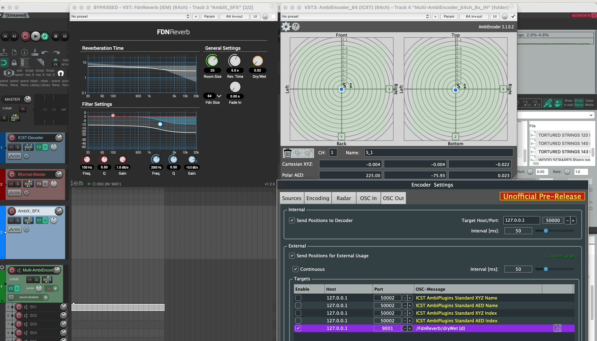

Institute for Computer Music and Sound Technology (ICST) Zurich University of the Arts

---

-----
# ICST AmbiEncoder sendet OSC zu FX-Plugins-Parameter

### Integration des ICST AmbiEncoder mit IEM FdnReverb via OSC

Dieses Beispiel zeigt eine einfache Synchronisierung zwischen **ICST AmbiEncoder** und **IEM Ambisonics Plugins**, wobei **FdnReverb** verwendet wird, um distanzabhängige Reverb anzuwenden. Die **OSC-Schnittstelle der IEM Plugins** macht diesen Prozess einfach.

### OSC <--> OSC Kommunikation

**FdnReverb** (von IEM) ist ein CPU-effizienter Reverb für B-Format. Das Ziel ist es, **den Reverb zu erhöhen, wenn die Quelle sich während der Raumalisierung weiter entfernt**.

#### 1. Richte die DAW ein (Reaper)

- Erstelle drei Spuren:
    - **ICST Decoder** → Stereo
    - **ICST Encoder (Mono/Panner)**
    - **IEM FdnReverb** → Reverb-Verarbeitung

#### 2. Konfiguriere OSC-Kommunikation

1. Öffne die **ICST AmbiEncoder**-Einstellungen und navigiere zum **OSC-Fenster**.
2. Aktiviere **OSC Send** für externe Verwendung.
3. Füge den **Dry/Wet-Parameter** aus **IEM FdnReverb** hinzu.
4. **OSC-Eingabe für IEM FdnReverb:**
    `/FdnReverb/dryWet {d}`
5. Aktiviere in **IEM FdnReverb** den **OSC Listener** (z.B. Port: 9001).
6. Klicke auf **IEM OSC**, stelle die Portnummer ein und drücke **Connect** (sollte grün werden, wenn aktiv).
7. Das Verschieben des **Panners** im ICST AmbiEncoder passt nun dynamisch den **Dry/Wet**-Parameter in FdnReverb an.

Mit zunehmender Entfernung wird auch die Reverb-Intensität zunehmen. Experimentiere mit anderen Reverb-Parametern für zusätzliche Effekte.

----
©2025 ICST
