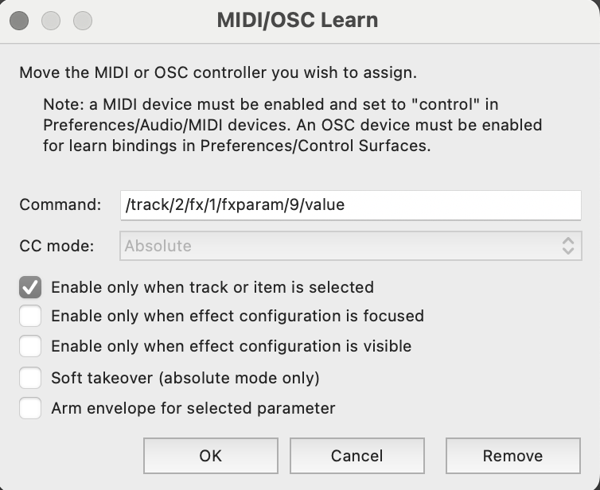
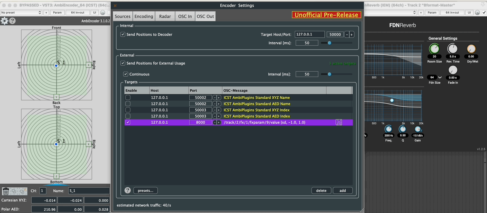

Institute for Computer Music and Sound Technology / (ICST) Zurich University of the Arts

* * *
# osc-send-for-osc-learning-in-reaper


1. Activate  the OSC in Reaper

    

2. Activate the OSC-Send in the 'ICST Ambisonics Encoder'
3. Choose your 'FX' in Reaper  
4. choose 'Midi-Learn' for the 'FX- Parameter'
   

```
/track/2/fx/1/fxparam/9/value {d} {sd, -0.0, 0.0}
```
- The IEM FDNReverb is included in track 2   
- The IEM FDNReverb is the first (fx) plug-in in the track  
- Dry/Wet is the 9th parameter of the IEM FDNReverb  
- The “Dry/Wet” parameter is determined by the incoming distance (the further away the sound, the more reverb it gets).  
  
**Example:** The “IEM FDNReverb” follows the AmbiEncoder distance.


  Gif example: zero distance 0.0 = dry in FX FDNReverb and distance 1.0 = wet

* * *
©2025 ICST

