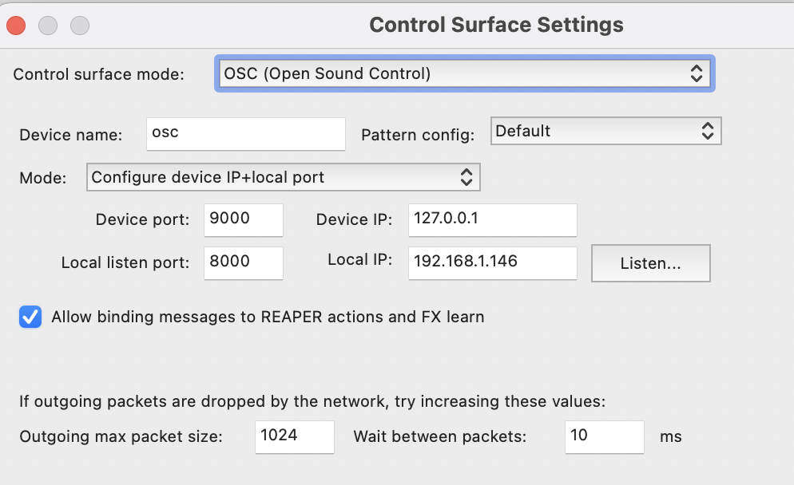
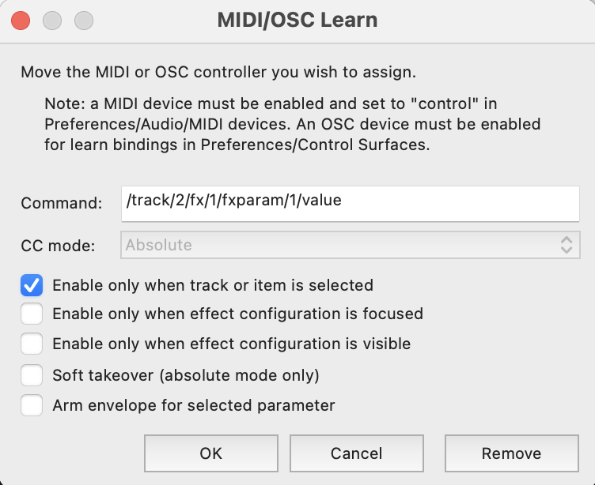

Institute for Computer Music and Sound Technology / (ICST) Zurich University of the Arts

* * *
# osc-send-for-osc-learning-in-reaper

1. Activate  the OSC in Reaper



2. Activate the OSC-Send in the 'ICST Ambisonics Encoder'
3. Choose your 'FX' in Reaper  

```
/track/2/fx/1/fxparam/1/value {d} {sd, -0.5, 0.5}
```

4. choose 'Midi-Learn' for the 'FX- Parameter'


**Example:**  The 'Cocko-ReaVerb' follows the AmbiEncoder-Distance.

Picture A: Zero Distance = Wet of the FX ReaVerb 0.0dB
Picture B: Distance  1.0 =  Wet of the FX ReaVerb +6.0dB


* * *
©2025 ICST

