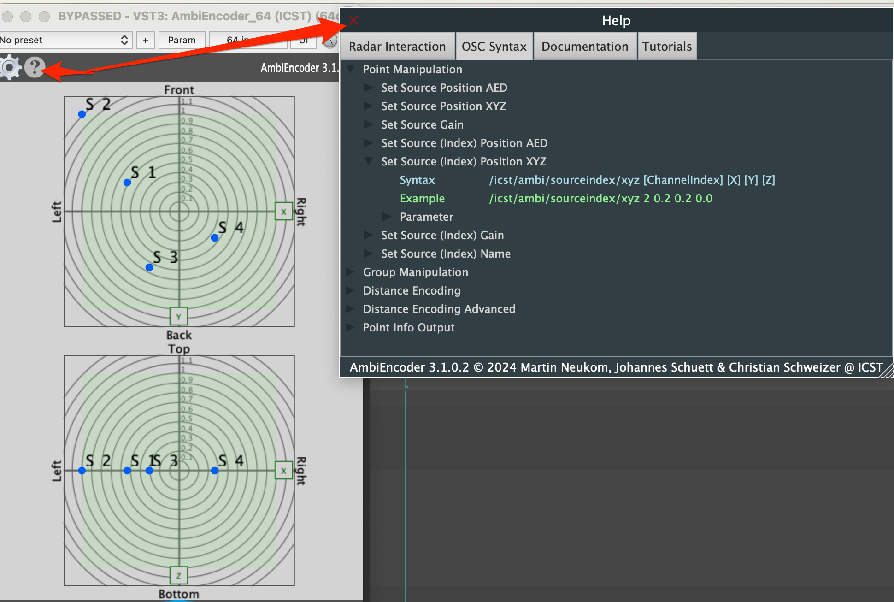
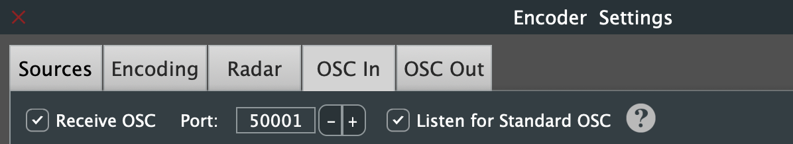
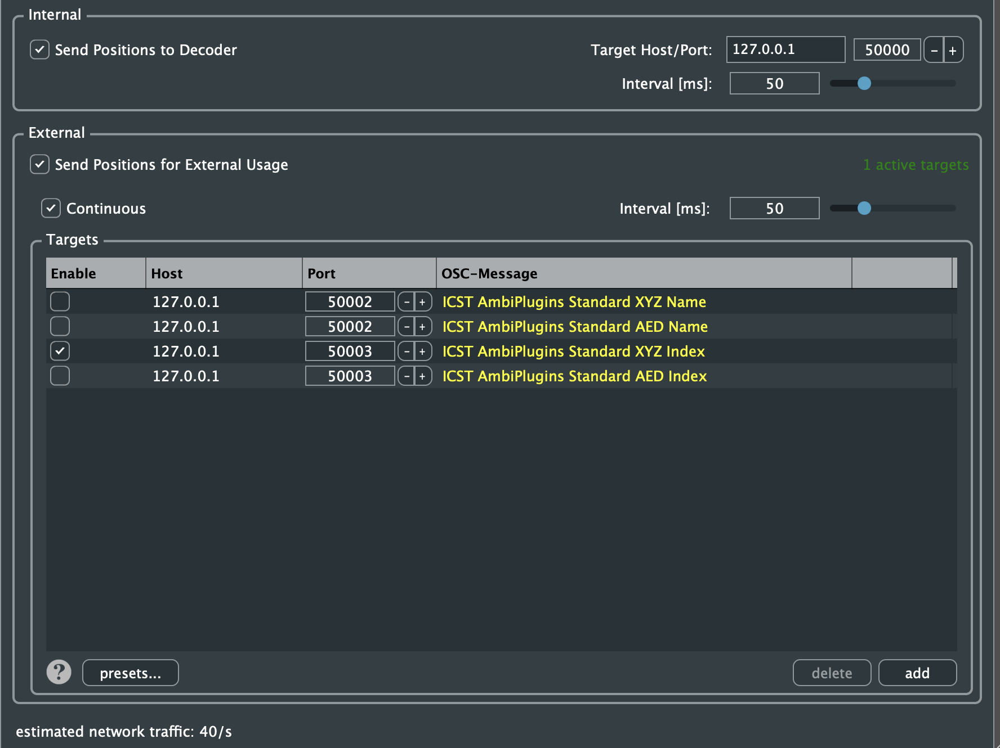
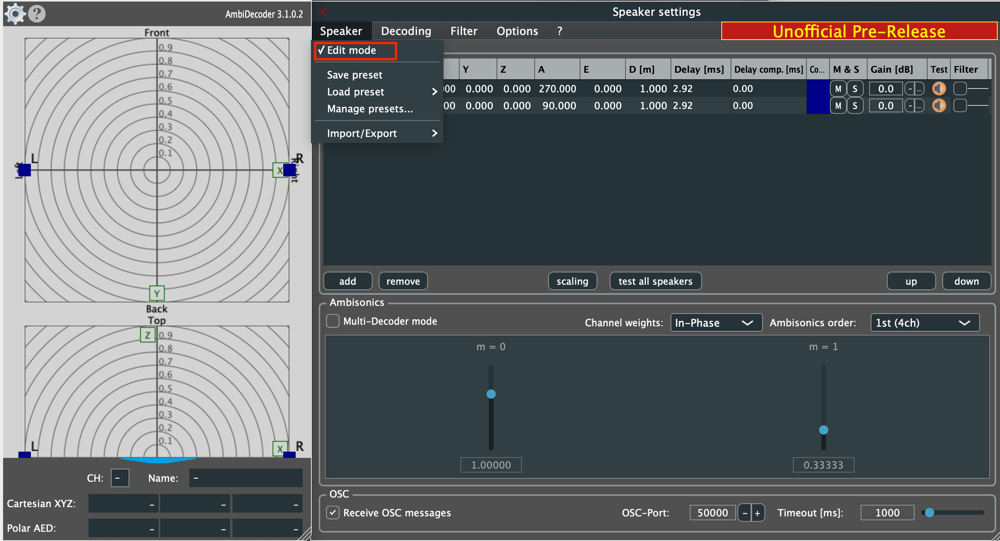
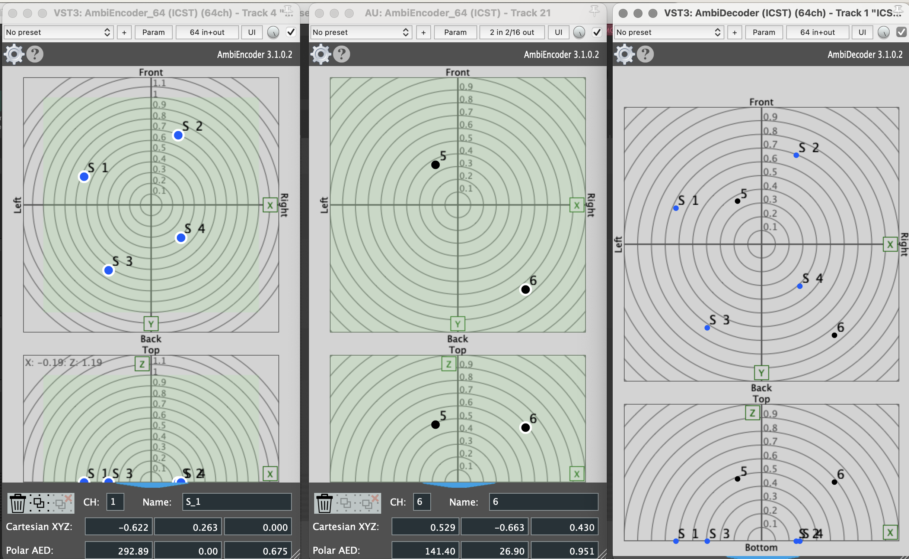

Institute for Computer Music and Sound Technology (ICST) Zurich University of the Arts

---

## OSC Syntax für das ICST AmbiEncoder Plugin

**Für wen:** Level: Advanced | Zielgruppe: Techniker:in, Developer, Max/OSC-User.


Der **ICST AmbiEncoder** unterstützt **OSC** und **JavaScript**, was eine nahtlose Kommunikation mit OSC-Tools wie **TouchOSC, IanniX, MaxMSP** und andere OSC-fähige Software ermöglicht.
Diese Seite ist die **Syntax-Referenz**.
Für Quickstart und Debugging-Reihenfolge nutze:
- [OSC im ICST AmbiEncoder - Die 10 wichtigsten Messages](/post/osc-10-key-messages/)

## **OSC Syntax & Adressspezifikation**

### **1. Zugriff auf OSC-Spezifikationen**

Klicke auf das **Fragezeichen** im ICST AmbiEncoder.
   

   _Abbildung: OSC-Spezifikationen im Help-Bereich._

Verfügbare Abschnitte:
- Help (**?**)
- OSC Syntax
- Sections
### **2. Eingehende OSC-Nachrichten**

Nachrichten können sein:

- **Index-basiert** (Quellen-Index), z.B. `1`
- **Name-basiert** (Quellenname), z.B. `flute`
#### **Quellenposition setzen (AED Format)**
```
	/icst/ambi/source/aed [ChannelName] [Azimuth] [Elevation] [Distance]
	/icst/ambi/source/aed 'S1' 45 10 0.8
```

#### **Quellenposition setzen (XYZ Format)**

```
	/icst/ambi/source/xyz [ChannelName] [X] [Y] [Z]
	/icst/ambi/source/xyz 'S2' 0.2 0.2 0.0
```

**Hinweis:** Der Kanalname (z.B S1, S2) wird als **Symbol** gesendet.

#### **Quellenposition nach Index setzen (AED Format)**

```
/icst/ambi/sourceindex/aed [ChannelIndex] [Azimuth] [Elevation] [Distance]
/icst/ambi/sourceindex/aed 1 45 10 0.8
```
#### **Quellenposition nach Index setzen (XYZ Format)**

```
/icst/ambi/sourceindex/xyz [ChannelIndex] [X] [Y] [Z]
/icst/ambi/sourceindex/xyz 2 0.2 0.2 0.0
```
**Hinweis:** Kanal-Indizes werden als **Ganzzahlen** gesendet.

* * *

## **Positionen für externe Verwendung senden**

1. Öffne den Tab **'OSC Out'**.




**Hinweis:** Das Standard-Format der ICST AmbiPlugins sendet **Quellennamen als Symbole**. Max-Benutzer sollten eine **Custom OSC Message** definieren:

```
/icst/ambi/sourceindex/xyz {i} {x} {y} {z}
/icst/ambi/sourceindex/aed {i} {a} {e} {d}

```




_Abbildung: Custom 'OSC Out' Editor_

#### **Interne OSC-Kommunikation**

Um **alle AmbiEncoder-Bewegungen** zum ICST AmbiDecoder zu senden:
1. Deaktiviere **Speaker Edit Mode** im AmbiDecoder.
2. Aktiviere den OSC-Port.






Jetzt empfängt der AmbiDecoder **alle OSC-Nachrichten** von allen verbundenen AmbiEncodern.

---
* * *
<span style="font-size:9px;color:#9f9f9f;">©2025 ICST</span>
