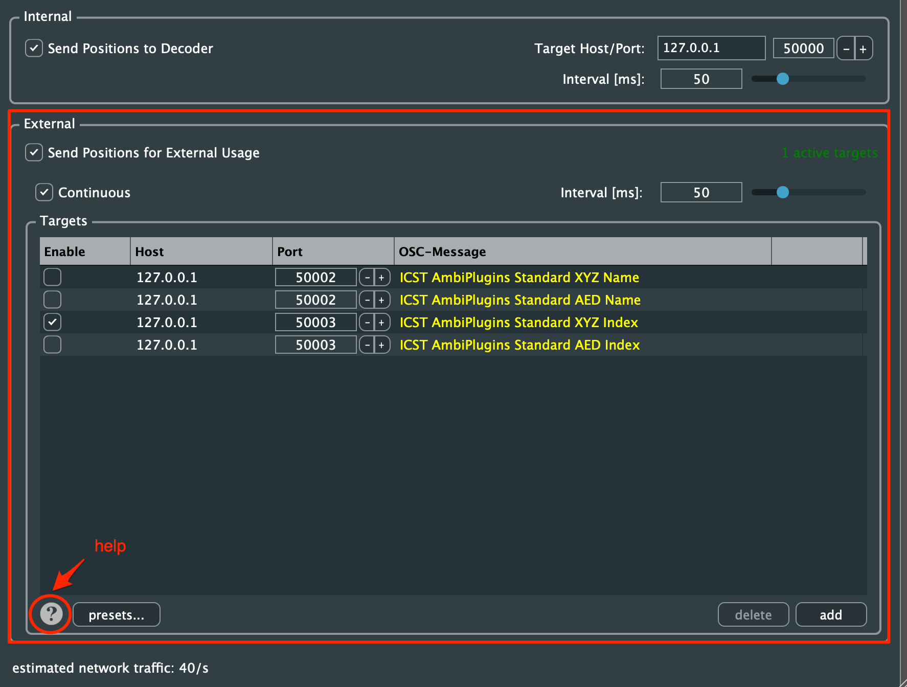

Institute for Computer Music and Sound Technology / (ICST) Zurich University of the Arts

---

## OSC Syntax for the ICST AmbiEncoder Plugin

The **ICST AmbiEncoder** supports **OSC** and **JavaScript**, enabling seamless communication with OSC tools such as **TouchOSC, IanniX, MaxMSP**, and other OSC-enabled software.

### **How It Works**

1. Open the **'OSC In'** tab.


_Figure: Encoder Setting 'OSC In' receives over the port 50001

Find all information in the **Help** section by clicking the question mark (**?**).

#### **OSC In**

*  **Receive OSC**: Receive OSC commands on the defined port (default: 50001). The full OSC specification is available in the plugin’s Help section.
- **Send Positions for External Usage**: This function sends audio source positions as OSC messages to a defined target/port. Messages trigger position changes, and the update rate is limited to **20Hz (50ms).**

* * *

## **OSC Syntax & Address Specification**

### **1. Accessing OSC Specifications**

Click the **question mark** in the ICST AmbiEncoder.
   
   
   _Figure: OSC specifications in the Help section._

Available sections:
- Help (**?**)
- OSC Syntax
- Sections
### **2. Incoming OSC Messages**

Messages can be:

- **Index-based** (source index), e.g., `1`
- **Name-based** (source name), e.g., `flute`
#### **Set Source Position (AED Format)**
```
	/icst/ambi/source/aed [ChannelName] [Azimuth] [Elevation] [Distance]
	/icst/ambi/source/aed 'S1' 45 10 0.8
```

#### **Set Source Position (XYZ Format)**
	
```
	/icst/ambi/source/xyz [ChannelName] [X] [Y] [Z]
	/icst/ambi/source/xyz 'S2' 0.2 0.2 0.0
```

**Note:** The channel name (e.g S1, S2) will be sent as **symbol**.

#### **Set Source (Index) Position (AED Format)**

```
/icst/ambi/sourceindex/aed [ChannelIndex] [Azimuth] [Elevation] [Distance]
/icst/ambi/sourceindex/aed 1 45 10 0.8
```
#### **Set Source (Index) Position (XYZ Format)**

```
/icst/ambi/sourceindex/xyz [ChannelIndex] [X] [Y] [Z]
/icst/ambi/sourceindex/xyz 2 0.2 0.2 0.0
```
**Note:** Channel indices are sent as **integers**.

* * *

## **Sending Positions for External Usage**

1. Open the **'OSC Out'** tab.


**Note:** The ICST AmbiPlugins standard format sends **source names as symbols**. Max users should define a **Custom OSC Message**:

```
/icst/ambi/sourceindex/xyz {i} {x} {y} {z}
/icst/ambi/sourceindex/aed {i} {a} {e} {d}

```


_Figure: Custom 'OSC Out' Editor_

#### **Internal OSC Communication**

To send **all AmbiEncoder movements** to the ICST AmbiDecoder:
1. Deactivate **Speaker Edit Mode** in the AmbiDecoder.
2. Activate the OSC port.


Now, the AmbiDecoder receives **all OSC messages** from all connected AmbiEncoders.

---
### **Steps to Send OSC Messages**

AmbiEncoder can also send most of its parameters via OSC.



Open the question mark before the presets to get detailed help information.  

1. Enable **“Send Positions for External Usage”** in the settings.
2. In the **Targets** section:
    - Enable or disable OSC transmission.
    - Define the **Host IP address**.
    - Select a **Port** (default: **50001**).
    - Double-click **OSC messages** to edit.
    
    **Note:** If participating in an **internal FX learning program**, select **“Continuous”** mode.
    
3. Click **Help (?)** for detailed OSC information.
4. Add or delete OSC messages.
5. Save or load OSC messages in **Presets**.

* * *
©2025 ICST


